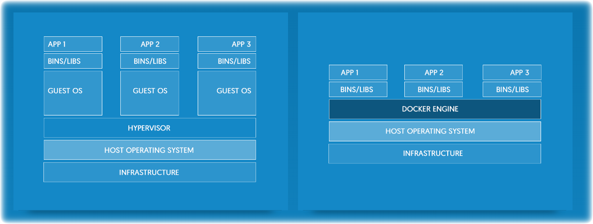

:title: Docker 101
:data-transition-duration: 1500
:css: hovercraft.css

Add a description here :)

----

**# whomai**
============

El Acheche Anis aka elacheche

Ubuntu-tn Member since 2009

SysAdmin since 2012

Official Ubuntu Member since 2014

Twitter: @elacheche

.. note::

        There was a note here once

----

**Ubuntu-Tn**
=============

Is the approved LoCo team for the Ubuntu users in Tunisia

Created in February 2007 & approved in the 22 July 2008

Main goal is to promote the use of Ubuntu & FOSS throughout the country

.. image:: images/ubuntu-tn.png

.. note::

    * Ubuntu-tn is the approved loco team for the Ubuntu users community in Tunisia. It is formed by volunteers who share a common passion toward free software, believe in this distribution and abide by to the message that it conveys: "humanity to others".

    * Ubuntu-tn's goal is to promote the use of the free operating system throughout the country by organizing public events, conferences and visits to schools and universities while assuring the help and the technical support necessary for the new users or those who still wonder if Ubuntu is made for them.

----

**Docker** : What! Why!
=========================

::

 Docker containers wrap up a piece of software in a complete filesystem
 that contains everything it needs to run: code, runtime, system tools,
 system libraries – anything you can install on a server.

 This guarantees that it will always run the same,
 regardless of the environment it is running in.

→ by Wikipedia

.. note::

    Add the link to the last slide.
    https://en.wikipedia.org/wiki/Docker_(software)

----

**Image**
=========

:: 

 An image is a lightweight, stand-alone, executable package that includes
 everything needed to run a piece of software, including the code,
 a runtime, libraries, environment variables, and config files.

----

**Container**
=============

::

 A container is a runtime instance of an image – what the image becomes in memory
 when actually executed. It runs completely isolated from the host environment
 by default, only accessing host files and ports if configured to do so.
 Containers run apps natively on the host machine’s kernel. They have better
 performance characteristics than virtual machines that only get virtual access
 to host resources through a hypervisor. Containers can get native access, each
 one running in a discrete process, taking no more memory than any other
 executable.

----

**Virtual Machine vs Docker**
=============================

----

**Docker in action**
====================

::

 $ docker run hello-world

*Output*

::

 | Unable to find image 'hello-world:latest' locally				|
 | latest: Pulling from library/hello-world					|
 | 78445dd45222: Pull complete							|
 | Digest: sha256:c5515758d4c5e1e838e9cd307f6c6a0d620b5e07e6f927b07d05f6d12a1ac8|
 | Status: Downloaded newer image for hello-world:latest			|	

 | Hello from Docker!								|

----

**Dockerfile**
==============

::

 $ cat Dockerfile

 FROM scratch

 COPY hello /

 CMD ["/hello"]

.. note::
        https://github.com/docker-library/hello-world/tree/bdee60d7ff6b98037657dc34a10e9ca4ffd6785f/hello-world

----

**Compose**
===========

::

 Compose is a tool for defining and running multi-container Docker applications.
 With Compose, you use a Compose file to configure your application’s services.
 Then, using a single command, you create and start all the services from your configuration.

----

**Swarm**
=========

::
 
 Docker swarm is a clustering tool, it makes it possible to create and manage a
 cluster of Docker nodes

----

**Is that what Docker is all about?**
=====================================

----

**Thanks for you attention**
============================

----

**Let the fun begin..**
========================

Go to: www.docker.com

.. note::

 http://juliend.github.io/linux-cheatsheet/#process

----

**How to join us**
==================

Anyone can be a Ubuntu-tn member, you need just to subscribe to our ML & contribute to the LoCo

* https://lists.ubuntu.com/mailman/listinfo/ubuntu-tn

You can find us here too..

* Website : www.ubuntu-tn.org
* IRC : #ubuntu-tn at freenode http://webchat.freenode.net/?channels=ubuntu-tn
* Failb00k : https://www.facebook.com/groups/ubuntu.tn/ & https://www.facebook.com/UbuntuTunisie
* Twitter : @UbuntuTn
